```mermaid
graph TD
    A[Início] --> B[Etapa 1]
    B --> C[Etapa 2]
    C --> D[Fim]
```

Using "Git it write" WordPress plugin, you can publish markdown present in a GitHub repository.

# hello world


| Month    | Savings |
| -------- | ------- |
| January  | $250    |
| February | $80     |
| March    | $420    |


Don't forget to leave a star on our repository! :star:

Think of Pieces as a technical Tinkerbell from Peter Pan[^2].

[^2]: This is a fairytale about a forever young boy who takes a group of British children to his home island, Neverland.


```js
console.log('Hello world');
```


Este é um exemplo de fórmula em linha: $E = mc^2$
Este é um exemplo de fórmula em linha: $E = mc^2$


$$ 
\int_a^b f(x) \, dx = F(b) - F(a)
$$
$$ 
\int_a^b f(x) \, dx = F(b) - F(a)
$$




<details> 
 <summary>Contacts 📞</summary>
  <br/>
    <a href="https://github.com/rick0x00" target="_blanck">GitHub</a>
    <a href="https://gitlab.com/rick0x00" target="_blanck">GitLab</a>
    <a href="https://www.linkedin.com/in/rick0x00" target="_blanck">Linkedin</a>
  <br/>
</details>


```bash
  #!/usr/bin/env bash

  # load libraries
  source /usr/local/bin/lib/message_log.lib
  source /usr/local/bin/lib/check_vars.lib
  source /usr/local/bin/lib/check_error.lib

  log_message "###### Setting DNS ######"

  DATE_NOW="$(date +"Y%Ym%md%d-H%HM%MS%S")"

  TMP_FILE="/tmp/resolv.conf"
  TARGET_FILE="/etc/resolv.conf"
  BACKUP_FILE="${TARGET_FILE}_${DATE_NOW}.bkp"


  function config_resolvconf() {
      log_message "# Creating DNS(resolv.conf) file..."

      # setting IPs of servers
      if [ -n ${DNS_SERVER_IPS} ]; then
          # loop to add all IPs
          for ip in ${DNS_SERVER_IPS} ; do
              echo "nameserver $ip" >> ${TMP_FILE}
          done

          # setting domain and search
          if [ -n ${DNS_SERVER_DOMAIN} ]; then
              echo "domain ${DNS_SERVER_DOMAIN}" >> ${TMP_FILE}
              echo "search ${DNS_SERVER_DOMAIN}" >> ${TMP_FILE}
          fi  

          # create backups
          log_message "# Creating backup of DNS(resolv.conf) file."
          cp -v ${TARGET_FILE} ${BACKUP_FILE}

          # apply settings
          log_message "# Setting DNS(resolv.conf) file."
          cp -v ${TMP_FILE} ${TARGET_FILE}

          # delete tmp file
          rm ${TMP_FILE}
      fi
  }


  if [[ -n ${DNS_SERVER_IPS} ]] || [[ -n ${DNS_SERVER_DOMAIN} ]] ; then
      config_resolvconf
  else
      log_message "####### DNS not configured ######"
      log_message "# Variables not defined:"
      log_message "#   {DNS_SERVER_DOMAIN} = ${DNS_SERVER_DOMAIN}"
      log_message "#   {DNS_SERVER_IPS} = ${DNS_SERVER_IPS}"
  fi
```

