```mermaid
graph TD
    A[Início] --> B[Etapa 1]
    B --> C[Etapa 2]
    C --> D[Fim]
```

Using "Git it write" WordPress plugin, you can publish markdown present in a GitHub repository.

# hello world


| Month    | Savings |
| -------- | ------- |
| January  | $250    |
| February | $80     |
| March    | $420    |


Don't forget to leave a star on our repository! :star:

Think of Pieces as a technical Tinkerbell from Peter Pan[^2].

[^2]: This is a fairytale about a forever young boy who takes a group of British children to his home island, Neverland.


```js
console.log('Hello world');
```


Este é um exemplo de fórmula em linha: $E = mc^2$
Este é um exemplo de fórmula em linha: $E = mc^2$


$$ 
\int_a^b f(x) \, dx = F(b) - F(a)
$$
$$ 
\int_a^b f(x) \, dx = F(b) - F(a)
$$




<details> 
 <summary>Contacts 📞</summary>
  <br/>
    <a href="https://github.com/rick0x00" target="_blanck">GitHub</a>
    <a href="https://gitlab.com/rick0x00" target="_blanck">GitLab</a>
    <a href="https://www.linkedin.com/in/rick0x00" target="_blanck">Linkedin</a>
  <br/>
</details>

